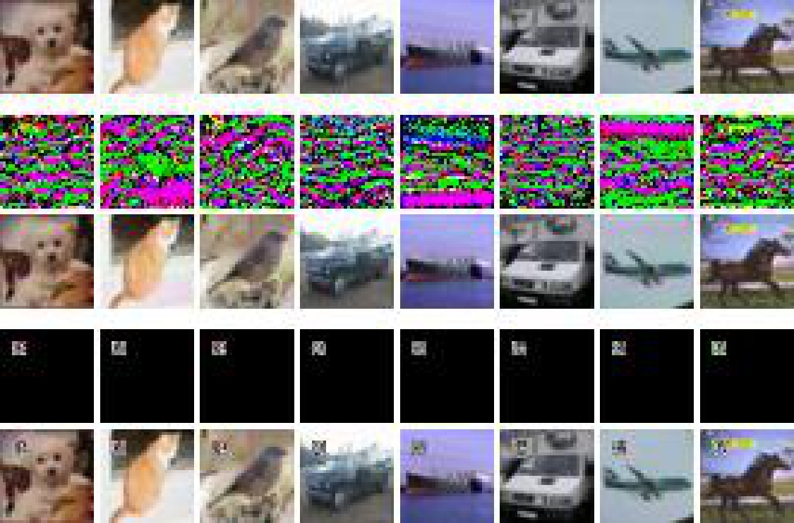
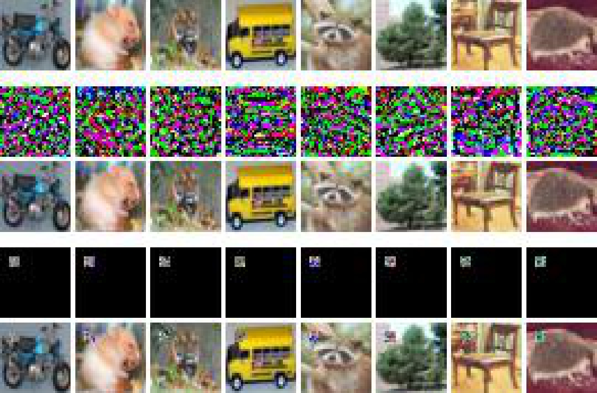
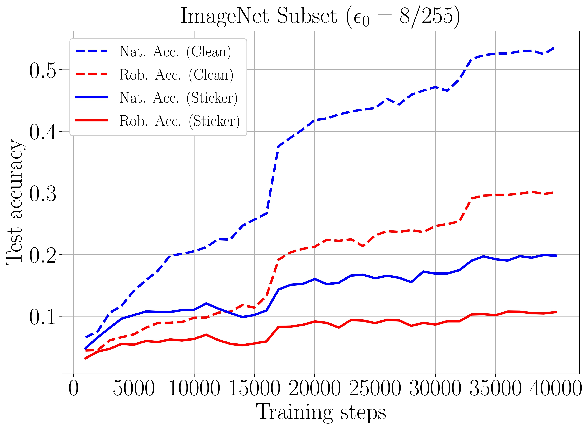

# Poison-adv-training
This code repository provides two poison attack methods (targeted attack & untargeted attack) against adversarial training algorithms. It aims to assess and reveal the vulnerabilities of adversarial learning algorithms.
Paper link: https://arxiv.org/abs/2305.00399

## Overview
***Adversarial training*** (AT) is a robust learning algorithm that can defend against adversarial attacks in the inference phase and mitigate the side effects of corrupted data in the training phase. 
As such, it has become an indispensable component of many artificial intelligence (AI) systems. 
However, in high-stake AI applications, it is crucial to understand AT's vulnerabilities to ensure reliable deployment.

In this work, we investigate AT's susceptibility to poisoning attacks, a type of malicious attack that manipulates training data to compromise the performance of the trained model.
Previous work has focused on poisoning attacks against ***standard training***, but little research has been done on their effectiveness against AT. 
To fill this gap, we design and test effective poisoning attacks against AT. 

Specifically, we investigate and design clean-label poisoning attacks, allowing attackers to imperceptibly modify a small fraction of training data to control the algorithm's behavior on a specific target data point.
Additionally, we propose the clean-label untargeted attack, enabling attackers can attach tiny ***stickers*** on training data to degrade the algorithm's performance on all test data, where the stickers could serve as a signal against unauthorized data collection.

We separately illustrate the two types of poison attacks mentioned above in Figure 1.

<p align="center">
	
	<p align="center">Figure 1(a). illustrates the clean-label targeted attack, where the attacker aims to control the behavior of the deep network on a specific target image only. The attacker modifies a tiny fraction of the training data, which appears unmodified and labeled correctly. A learner then trains a network from scratch with this modified dataset. The attacker's minor modification only makes the network output the attacker-specified label on the specific and unperturbed target image without affecting predictions on other input data.</p>
</p>

&nbsp;

<p align="center">
	
	<p align="center">Figure 1(b). shows the clean-label untargeted attack, where the attacker attaches tiny stickers to publicly released images. These stickers signal to the unauthorized data collectors that those images are prohibited from being collected, and otherwise, they will significantly harm the learner, even if the learner employs adversarial training to train a model.</p>
</p>

## Prerequisites
Python (3.8)  
Pytorch (1.8.0)  
CUDA  
Numpy  

## Usage
### Targeted Attack
First, in Figure 2, we provides a ***visualization*** of clean-label targeted poisoning attacks carried out by Witches' Brew (WB) [[link](https://arxiv.org/pdf/2009.02276.pdf)] and our proposed targeted attack method, respectively. 
The top row shows unperturbed natural images, while the second and third rows depict the imperceptible noise (scaled by 3 times for visualization) and the poisoned images by WB. 
Similarly, the fourth and fifth rows depict the imperceptible noise (scaled by 3 times for visualization) and the poisoned images generated by our method. 
All poisoning noises are bounded by $\ell_{\infty}$-norm with $\epsilon = 16/255$.

<p align="center">
	
	
	<p align="center">Figure 2. Visualization on CIFAR-10 (left) and Tiny ImageNet (right).</p>
</p>

To ***generate*** clean-label targeted poison data and ***validate*** it on the robust learner, you can simply run the following command.
```
python tar_poisoning.py --dataset CIFAR10 --poisonkey 2000000000 --eps 16 --tau 0.01 --budget 0.04 --attackiter 250 --restarts 8 --vruns 4
```

If you want to skip the generation stage and directly validate the poison attack, we have also shared the targeted poison data we generated on [Google Drive](https://drive.google.com/drive/folders/1HfP8IRZUanEZeRQ4TVrxkNBDxt93U0QR?usp=sharing). 
You can use the ***validate_tar_poisoning.py*** to load and evaluate its effectiveness on the robust learner.

Here, we present our evaluation results for WB and our proposed attack on natural (Nat.) and adversarial (Adv.) targets, as shown in Figure 3.
Note that a lower Log-scaled logit difference indicates a higher success rate of the attacks. When it falls below 0 (dashed line), it indicates that the majority of the attacks have been successful.
The default dataset is CIFAR-10. You can specify the experimental dataset as Tiny ImageNet by using the parameter ```--dataset TinyImageNet```. To reproduce the results shown in Figure 3, you can adjust the parameter ```--eps``` from $4$ to $16$.

<p align="center">
	
	
	<p align="center">Figure 3. Clean-label targeted poison attacks against robust learners with a different perturbation radius $\epsilon$ by a attacker. The points below the gray dashed line signify the success of the poisoning attack in manipulating the robust learner's behavior on a chosen target.</p>
</p>

### Untargeted Attack
Similarly, as shown in Figure 4, we first demonstrate the ***visualization*** of clean-label untargeted poisoning attacks generated by robust error-minimizing noise (REM) [[link](https://arxiv.org/pdf/2203.14533.pdf)] and our method. The top row displays the original natural images. The second and third rows show the imperceptible noise (scaled by 31 times for visualization) and the corresponding poisoned images generated by REM. The fourth and fifth rows display the human-visible stickers and our poisoned images.

<p align="center">
	
	
	<p align="center">Figure 4. Visualization on CIFAR-10 (left) and CIFAR-100 (right).</p>
</p>

On the ImageNet Subset, we visualize the clean-label untargeted poisoning attacks performed by our sticker in Figure 5. 
The first row has unperturbed natural images. The second row has our poisoned images attached with stickers.

<p align="center">
	
	<p align="center">Figure 5. Visualization on ImageNet Subset.</p>
</p>

Run the following command to ***generate*** clean-label untargeted poison data. 
For convenience, we have shared our generated untargeted poison data on [Google Drive](https://drive.google.com/drive/folders/1Ycn46Vd4PbkHSmFg0N0uwTVt3YRpAZ8I?usp=sharing). You can download it directly to skip the generation step.
```
python untar_poisoning.py --dataset cifar10 --train-steps 5000 --optim sgd --lr 0.1 --lr-decay-rate 0.1 --lr-decay-freq 2000 --pgd-steps 10 --pgd-step-size 35 --pgd-random-start --patch-size 0.03 --location 4
```
Then, run the following command to ***validate*** clean-label untargeted poison data on the robust learner.
```
python validate_untar_poisoning.py --seed 2000000000 --noise-rate 0.5 --train-steps 15000 --optim sgd --lr 0.1 --lr-decay-rate 0.1 --lr-decay-freq 6000 --pgd-radius 8 --pgd-steps 10 --pgd-step-size 1.6 --pgd-random-start --report-freq 200 --save-freq 100000 --noise-path ./exp_data/untargeted/patch_cifar10_loc4_ss35_ps0.03/poisons/patch-fin-def-noise.pkl --mask-path ./exp_data/untargeted/patch_cifar10_loc4_ss35_ps0.03/poisons/patch-fin-def-mask.pkl --save-name train
```

In Table 1, we report the evaluation results of robust learners trained with different perturbation radii $\epsilon_{0}$ on both clean training set and poisoned training sets. 
The poisoned training sets are generated by REM and our untargeted attack method, respectively.
For clarity, we have used *'+'* or *'-'* inside parentheses to indicate whether the poison attacks improved or decreased the performance of the robust learner, respectively. A greater decrease indicates a more effective attack.

You can replicate the results in the table by modifying the parameters in the validation script ***validate_untar_poisoning.py***. Use ```--dataset``` to modify the experimental dataset, ```--pgd-radius``` and ```--pgd-step-size``` to adjust the training perturbation radius and step size of the robust learner, and ```--noise-path``` and ```--mask-path``` to specify the paths for the noise and mask data, respectively.

<table style="font-size: 12px;">
    <caption style="font-size: 12px;">Table 1. The best natural/robust test accuracy (%) (± standard deviations) of the robust learners on clean set and poisoned set by REM and our untargeted attack, respectively.</caption>
	<tr>
	<th rowspan="2"><sub>Dataset</sub></th>
	<th rowspan="2"><sub>$\epsilon_0$</sub></th>
	<th colspan="2"><sub>Clean</sub></th>
	<th colspan="2"><sub>REM</sub></th>
	<th colspan="2"><sub>Ours</sub></th>
	</tr >
    <tr>
        <th><sub>Nat.</sub></th><th><sub>Rob.</sub></th>
	<th><sub>Nat.</sub></th><th><sub>Rob.</sub></th>
	<th><sub>Nat.</sub></th><th><sub>Rob.</sub></th>
    </tr>
    <tr align="center">
        <th rowspan="4"><sub>CIFAR-10</sub></th>
        <td><sub>4/255</sub></td>
	<td><sub>88.78</sub></td><td><sub>67.22</sub></td><td><sub>51.42±1.36 (-37.36)</sub></td><td><sub>31.93±0.85 (-35.29)</sub></td><td><sub>70.30±0.62 (-18.48)</sub></td><td><sub>50.58±0.64 (-16.64)</sub></td>        </tr>
    <tr align="center">
        <td><sub>8/255</sub></td>
	<td><sub>81.45</sub></td><td><sub>50.47</sub></td><td><sub>83.68±0.19 (+2.23)</sub></td><td><sub>37.92±0.31 (-12.55)</sub></td><td><sub>63.69±0.63 (-17.75)</sub></td><td><sub>38.39±0.39 (-12.08)</sub></td>        </tr>
    <tr align="center">
        <td><sub>12/255</sub></td>
	<td><sub>72.26</sub></td><td><sub>40.03</sub></td><td><sub>74.08±0.64 (+1.18)</sub></td><td><sub>36.97±0.16 (-3.06)</sub></td><td><sub>66.02±1.49 (-6.24)</sub></td><td><sub>36.61±0.72 (-3.41)</sub></td>        </tr>
    <tr align="center">
        <td><sub>16/255</sub></td>
	<td><sub>62.01</sub></td><td><sub>32.68</sub></td><td><sub>63.58±0.58 (+1.57)</sub></td><td><sub>31.82±0.28 (-0.85)</sub></td><td><sub>60.40±0.61 (-1.61)</sub></td><td><sub>32.04±0.51 (-0.64)</sub></td>        </tr>
    <tr align="center">
	<th rowspan="4"><sub>CIFAR-100</sub></th>
        <td><sub>4/255</sub></td>
	<td><sub>64.43</sub></td><td><sub>39.20</sub></td><td><sub>40.68±0.53 (-23.75)</sub></td><td><sub>22.30±0.77 (-16.90)</sub></td><td><sub>39.69±0.67 (-24.74)</sub></td><td><sub>25.93±0.34 (-13.27)</sub></td>        </tr>
    <tr align="center">
        <td><sub>8/255</sub></td>
	<td><sub>56.36</sub></td><td><sub>27.95</sub></td><td><sub>56.74±0.14 (+0.38)</sub></td><td><sub>26.55±0.05 (-1.40)</sub></td><td><sub>51.11±2.40 (-5.24)</sub></td><td><sub>25.82±0.73 (-2.13)</sub></td>        </tr>
    <tr align="center">
        <td><sub>12/255</sub></td>
	<td><sub>47.44</sub></td><td><sub>21.20</sub></td><td><sub>48.80±0.16 (+1.36)</sub></td><td><sub>20.44±0.10 (-0.75)</sub></td><td><sub>47.11±0.31 (-0.32)</sub></td><td><sub>20.80±0.11 (-0.39)</sub></td>        </tr>
    <tr align="center">
        <td><sub>16/255</sub></td>
	<td><sub>38.64</sub></td><td><sub>17.17</sub></td><td><sub>39.73±0.36 (+1.08)</sub></td><td><sub>16.51±0.10 (-0.65)</sub></td><td><sub>37.95±0.12 (-0.69)</sub></td><td><sub>16.94±0.13 (-0.22)</sub></td>        </tr>
</table>

For the ImageNet Subset, in Figure 6, we present the test accuracy curves of the robust learner trained with a perturbation radius of $\epsilon_{0} = 8/255$ on both the clean training set and the poisoned training set generated by our untargeted attack.

<p align="center">
	
	<p align="center">Figure 6. Test accuracy curves of robust learner with $\epsilon_{0}=8/255$ on the clean set and the poisoned set.</p>
</p>

