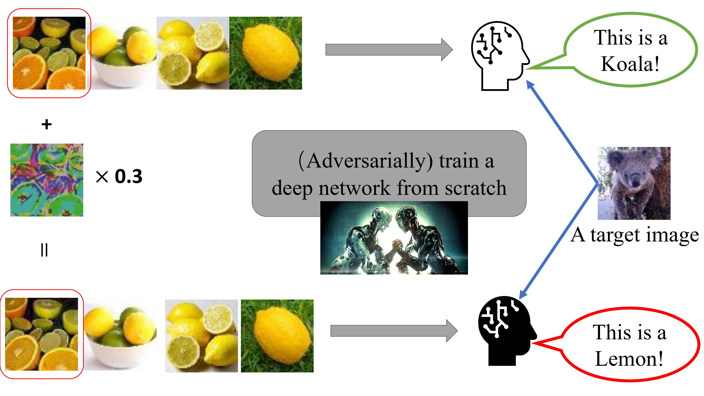
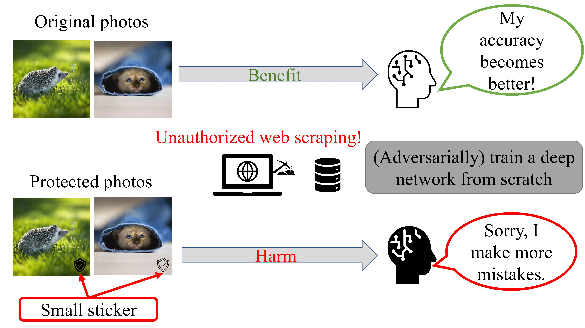
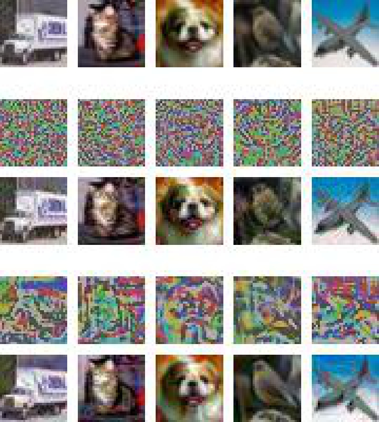
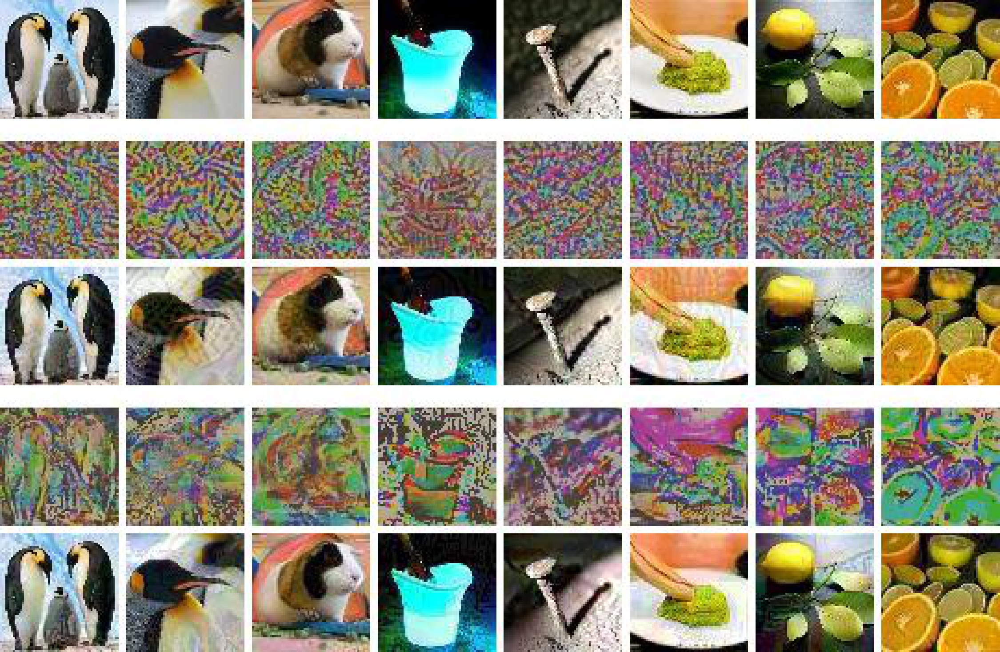
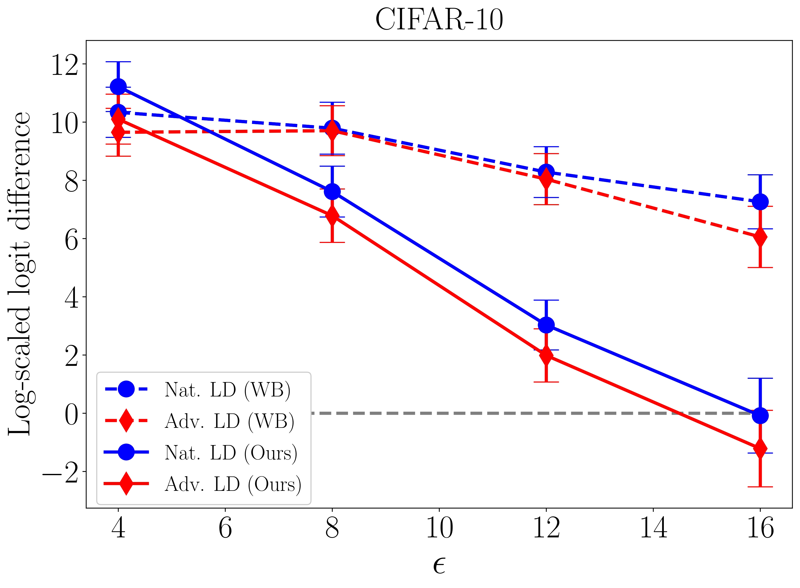
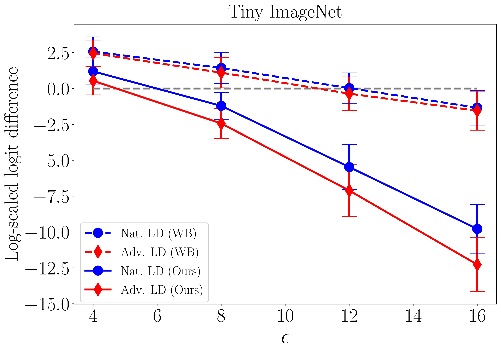

# Poison-adv-training
This code repository provides two poison attack methods (targeted attack & untargeted attack) against adversarial training algorithms, revealing the vulnerability of adversarial learning algorithms.

## Overview
***Adversarial training*** (AT) is a robust learning algorithm that can defend against adversarial attacks in the inference phase and mitigate the side effects of corrupted data in the training phase. 
As such, it has become an indispensable component of many artificial intelligence (AI) systems. 
However, in high-stake AI applications, it is crucial to understand AT's vulnerabilities to ensure reliable deployment.

In this work, we investigate AT's susceptibility to poisoning attacks, a type of malicious attack that manipulates training data to compromise the performance of the trained model.
Previous work has focused on poisoning attacks against ***standard training***, but little research has been done on their effectiveness against AT. 
To fill this gap, we design and test effective poisoning attacks against AT. 

Specifically, we investigate and design clean-label poisoning attacks, allowing attackers to imperceptibly modify a small fraction of training data to control the algorithm's behavior on a specific target data point.
Additionally, we propose the clean-label untargeted attack, enabling attackers can attach tiny ***stickers*** on training data to degrade the algorithm's performance on all test data, where the stickers could serve as a signal against unauthorized data collection.

We separately illustrate the two types of poison attacks mentioned above in Figure 1.

<p align="center">
	
	<p align="center">Figure 1(a). illustrates the clean-label targeted attack, where the attacker aims to control the behavior of the deep network on a specific target image only. The attacker modifies a tiny fraction of the training data, which appears unmodified and labeled correctly. A learner then trains a network from scratch with this modified dataset. The attacker's minor modification only makes the network output the attacker-specified label on the specific and unperturbed target image without affecting predictions on other input data.</p>
</p>

&nbsp;

<p align="center">
	
	<p align="center">Figure 1(b). shows the clean-label untargeted attack, where the attacker attaches tiny stickers to publicly released images. These stickers signal to the unauthorized data collectors that those images are prohibited from being collected, and otherwise, they will significantly harm the learner, even if the learner employs adversarial training to train a model.</p>
</p>

## Prerequisites
Python (3.8)  
Pytorch (1.8.0)  
CUDA  
Numpy  

## Usage
### Targeted Attack
First, in Figure 2, we provides a visualization of clean-label targeted poisoning attacks carried out by Witches' Brew (WB) and our proposed targeted attack method, respectively. 
The top row shows unperturbed natural images, while the second and third rows depict the imperceptible noise (scaled by 3 times for visualization) and the poisoned images by WB. 
Similarly, the fourth and fifth rows depict the imperceptible noise (scaled by 3 times for visualization) and the poisoned images generated by our method. 
All poisoning noises are bounded by $\ell_{\infty}$-norm with $\epsilon = 16/255$.

<p align="center">
	
	<p align="center">Figure 2(a). Visualization on CIFAR-10.</p>
</p>

&nbsp;

<p align="center">
	
	<p align="center">Figure 2(b). Visualization on Tiny ImageNet.</p>
</p>

To generate clean-label targeted poison data and validate it on the robust learner, you can simply run the following command.
```
python tar_poisoning.py --poisonkey 2000000000 --eps 16 --tau 0.01 --budget 0.04 --attackiter 250 --restarts 8 --vruns 4
```

If you want to skip the generation stage and directly validate the poison attack, we have also shared the targeted poison data we generated on [Google Drive](https://drive.google.com/drive/folders/1HfP8IRZUanEZeRQ4TVrxkNBDxt93U0QR?usp=sharing). 
You can use the ***validate_tar_poisoning.py*** to load and evaluate its effectiveness on the robust learner.

Here, we present our evaluation results, as shown in Figure 3. Note that a lower Log-scaled logit difference indicates a higher success rate of the attacks. 
When it falls below 0 (dashed line), it indicates that the majority of the attacks have been successful.
You can use the parameter ```--dataset TinyImageNet``` to specify the experimental dataset and adjust the parameter ```--eps``` from $4$ to $16$ to reproduce the results shown in Figure 3.

<p align="center">
	
	
	<p align="center">Figure 3. Clean-label targeted poison attacks against a robust learner with a different perturbation radius $\epsilon$ by a attacker. The points below the gray dashed line signify the success of the poisoning attack in manipulating the robust learner's behavior on a chosen target.</p>
</p>

### Untargeted Attack
Run the following command to generate clean-label untargeted poison data.
```
python untar_poisoning.py --train-steps 5000 --optim sgd --lr 0.1 --lr-decay-rate 0.1 --lr-decay-freq 2000 --pgd-steps 10 --pgd-step-size 35 --pgd-random-start --patch-size 0.03 --location 4
```
Then, run the following command to validate clean-label untargeted poison data on the robust learner.
```
python validate_untar_poisoning.py --seed 2000000000 --noise-rate 0.5 --train-steps 15000 --optim sgd --lr 0.1 --lr-decay-rate 0.1 --lr-decay-freq 6000 --pgd-radius 8 --pgd-steps 10 --pgd-step-size 1.6 --pgd-random-start --report-freq 200 --save-freq 100000 --noise-path ./exp_data/untargeted/patch_cifar10_loc4_ss35_ps0.03/poisons/patch-fin-def-noise.pkl --mask-path ./exp_data/untargeted/patch_cifar10_loc4_ss35_ps0.03/poisons/patch-fin-def-mask.pkl --save-name train
```

## Generated Poison Resource
We have shared our generated [targeted poison data](https://drive.google.com/drive/folders/1HfP8IRZUanEZeRQ4TVrxkNBDxt93U0QR?usp=sharing) and [untargeted poison data](https://drive.google.com/drive/folders/1Ycn46Vd4PbkHSmFg0N0uwTVt3YRpAZ8I?usp=sharing) on Google Drive.
